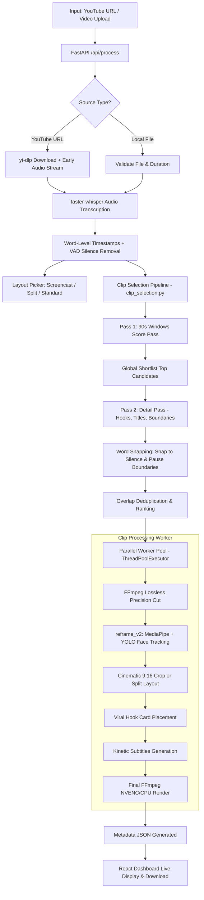

# 🎬 GetShorts — Full Project Architecture & Workflow Analysis

> **Comprehensive Technical Breakdown & Clip Discovery Deep Dive**  
> Yeh document **GetShorts** ka mukammal workflow, internal architecture aur AI-driven viral clip detection engine detail se explain karta hai.

---

## 📌 Table of Contents
1. [Project Overview (GetShorts Kya Hai?)](#1-project-overview)
2. [Tech Stack & Core Components](#2-tech-stack--core-components)
3. [End-to-End Workflow (Complete Pipeline)](#3-end-to-end-workflow)
4. [Deep Dive: Clips Kaise Findout Karta Hai? (AI Clip Detection Engine)](#4-deep-dive-clips-kaise-findout-karta-hai)
   - [4.1 Windowing: 90s Overlapping Windows](#41-transcript-windowing)
   - [4.2 Pass 1: Scoring Pass (Fast Batch Evaluation)](#42-pass-1-scoring-pass)
   - [4.3 Dynamic Shortlisting](#43-dynamic-shortlisting)
   - [4.4 Pass 2: Detail Extraction Pass](#44-pass-2-detail-extraction-pass)
   - [4.5 The 2-Second Test & Stands Alone Rule](#45-the-2-second-test--stands-alone-rule)
   - [4.6 Millisecond Precision: Word-Level Snapping](#46-millisecond-precision-word-level-snapping)
   - [4.7 Overlap Deduplication & Score-Based Ranking](#47-overlap-deduplication--ranking)
   - [4.8 Silent Video Fallback (Vision Analysis)](#48-silent-video-fallback)
5. [Computer Vision & 9:16 Vertical Reframing Engine](#5-computer-vision--vertical-reframing-engine)
   - [Face & Person Detection (MediaPipe & YOLOv8)](#face--person-detection)
   - [Active Speaker Detection (Lip Motion + Audio Energy)](#active-speaker-detection)
   - [Smart Layout Selection (None, Split, Screencast)](#smart-layout-selection)
   - [Smoothed Cameraman (Cinematic Panning)](#smoothed-cameraman)
6. [Viral Subtitles & Kinetic Typography Engine](#6-viral-subtitles--kinetic-typography-engine)
7. [Viral Hook Cards & Dynamic Placement](#7-viral-hook-cards--dynamic-placement)
8. [Multi-Threaded Rendering & Video Delivery](#8-multi-threaded-rendering--delivery)
9. [Web Dashboard & Remotion Preview](#9-web-dashboard--remotion-preview)
10. [Repository Directory Structure](#10-repository-directory-structure)

---

## 1. Project Overview

**GetShorts** aik fully automated, open-source AI video repurposing platform hai. Iska primary maqsad lambi horizontal (16:9) videos (maslan YouTube podcasts, tutorials, interviews, gaming videos) ko high-engagement vertical (9:16) shorts/reels/TikToks mein convert karna hai.

Yeh sirf aik simple video cutter nahi hai, balki isme:
1. **AI Viral Moment Detection**: Gemini ya Local LLM ke zariye transcript analyze kar ke highest retention wale moments dhoondta hai.
2. **Computer Vision Reframing**: MediaPipe aur YOLOv8 se face aur body track kar ke 9:16 vertical frame create karta hai.
3. **Active Speaker Tracking**: Do logon ki baat cheet mein lip sync aur audio energy se pata lagata hai ke kaun bol raha hai.
4. **Kinetic Viral Subtitles**: MrBeast aur Alex Hormozi style dynamic, punch-word highlighted subtitles generate karta hai.
5. **Viral Hook Overlay**: Video ke pehle 3-5 seconds mein curiosity generate karne wala hook card lagata hai.

---

## 2. Tech Stack & Core Components

| Component | Technology / Library | Purpose |
| :--- | :--- | :--- |
| **Backend API** | FastAPI, Uvicorn, Python 3.10+ | Job queueing, REST APIs, SSE status updates, Webhooks |
| **Orchestrator** | [`main.py`](file:///home/zeeshan/Desktop/openshorts/main.py) | CLI aur worker pipeline coordination |
| **Audio Transcription** | `faster-whisper` (int8, VAD filter) | Fast, word-level timestamped speech-to-text |
| **AI LLM Engine** | Google Gemini (3.1/3.5 Flash, 2.5) / Ollama / Local LLM | Semantic virality analysis, hook copywriting, scoring |
| **Clip Selection Engine** | [`clip_selection.py`](file:///home/zeeshan/Desktop/openshorts/clip_selection.py) | Mathematical windowing, word boundary snapping, deduplication |
| **Video Processing** | FFmpeg, PyAV, OpenCV | High-speed decoding, hardware-accelerated encoding (NVENC / CPU) |
| **Face & Body Tracking** | MediaPipe BlazeFace, YOLOv8 | Real-time speaker detection and cinematic bounding boxes |
| **Layout & Reframing** | [`reframe_v2.py`](file:///home/zeeshan/Desktop/openshorts/reframe_v2.py), [`split_layout.py`](file:///home/zeeshan/Desktop/openshorts/split_layout.py) | Split-screen (podcast), Single-speaker crop, Screencast with webcam inset |
| **Subtitles Engine** | [`subtitles.py`](file:///home/zeeshan/Desktop/openshorts/subtitles.py) (Advanced ASS / SSA) | Kinetic typography, Karaoke highlight, Two-line punch stack |
| **Frontend UI** | React, Vite, Remotion, TailwindCSS | Web dashboard, real-time job progress, interactive clip editor |

---

## 3. End-to-End Workflow

Neeche diagram mein GetShorts ka mukammal execution lifecycle dikhaya gaya hai:



### Detailed Pipeline Steps:
1. **Ingestion ([`app.py`](file:///home/zeeshan/Desktop/openshorts/app.py)):** User YouTube link deta hai ya video file upload karta hai. Job ID generate hoti hai.
2. **Early Audio Pipeline:** Agar YouTube URL ho, toh video poori download hone se pehle hi audio stream alag kar ke Whisper transcription shuru ho jati hai (Zero idle time!).
3. **Speech-to-Text ([`transcribe_backends.py`](file:///home/zeeshan/Desktop/openshorts/transcribe_backends.py)):** `faster-whisper` (default model `small` with `int8` quantization) audio ko process karta hai aur har word ka exact start/end time record karta hai.
4. **Layout Selection ([`layout_picker.py`](file:///home/zeeshan/Desktop/openshorts/layout_picker.py)):** Video ke sample frames AI ko dikhaye jaate hain taake decide ho sake ke video "Camera" (normal talking head), "Screencast" (slides/coding), ya "Split" (two-person podcast) hai.
5. **AI Clip Finding ([`clip_selection.py`](file:///home/zeeshan/Desktop/openshorts/clip_selection.py) & [`gemini_worker.py`](file:///home/zeeshan/Desktop/openshorts/gemini_worker.py)):** Transcript ko smart windows mein divide kar ke virality score diya jata hai aur clips extract ki jaati hain (Details section 4 mein).
6. **Parallel Rendering ([`main.py`](file:///home/zeeshan/Desktop/openshorts/main.py)):** Har clip ko parallel worker threads (default 6 workers) ke zariye alag process kiya jata hai:
   - Video cut hoti hai.
   - Reframing engine face track karta hai.
   - Dynamic 9:16 crop apply hoti hai.
   - Viral hook overlay aur kinetic subtitles burn kiye jaate hain.
7. **Delivery & Live Edit:** Final `.mp4` video dashboard par play hone ke liye ready hoti hai aur Remotion clip editor mein custom adjustment ke liye available ho jati hai.

---

## 4. Deep Dive: Clips Kaise Findout Karta Hai?

Yeh GetShorts ka sab se powerful aur intelligent hissa hai. Aam tools poori transcript aik prompt mein bhej dete hain jis se shuru ke hisse se hi clips uth jati hain aur aakhri hissa miss ho jata hai. GetShorts **Two-Pass Scalable Windowing Architecture** use karta hai:

### 4.1 Transcript Windowing
- Function: `build_transcript_windows()` ([`clip_selection.py`](file:///home/zeeshan/Desktop/openshorts/clip_selection.py#L203))
- **Logic:** Transcript ko randomly seconds se nahi kata jata, balki **Whisper sentence/segment boundaries** par align kiya jata hai taake koi sentence ya dialogue aadha na kate.
- Har window taqreeban **90 seconds** ki hoti hai aur har agli window pichli window ke sath **30 seconds overlap** karti hai.
- Iska faida yeh hai ke agar koi viral moment do windows ke darmiyan aa raha ho, toh overlap ki wajah se woh kabhi miss nahi hota.

```
Window 1: [0s ----------------------- 90s]
Window 2:             [60s ----------------------- 150s]
Window 3:                         [120s ----------------------- 210s]
```

### 4.2 Pass 1: Scoring Pass (Fast Batch Evaluation)
- Windows ko manageable batches mein divide kiya jata hai (`score_batches()`).
- AI model (Gemini ya Local LLM) ko fast scoring prompt (`SCORE_PROMPT_TEMPLATE`) diya jata hai.
- **Rules jo model follow karta hai:**
  1. **The 2-Second Test:** Kya is clip ke pehle 2 seconds kisi stranger ko scroll karne se rok sakte hain?
  2. **Score Range (0-100):** Filler, intros, outros, low-signal baaton ko <30 score milta hai. 70+ sirf high-energy, conflict, shock, curiosity ya big payoff moments ko milta hai.
  3. Model har window ke sath score aur aik short reason return karta hai:
     ```json
     {
       "id": "window_003",
       "start": 120.4,
       "end": 210.1,
       "score": 88,
       "reason": "Strong conflict statement about startup failure with immediate hook"
     }
     ```

### 4.3 Dynamic Shortlisting
- Function: `shortlist_target(video_duration)` ([`clip_selection.py`](file:///home/zeeshan/Desktop/openshorts/clip_selection.py#L70))
- Video ki length ke mutabiq best candidate windows select ki jaati hain:
  $$\text{target} = \max\left(3, \min\left(10, \frac{\text{seconds}}{90} + 2\right)\right)$$
- Tamam scored windows ko sort kar ke sirf top scoring windows ko **Pass 2** ke liye shortlist kiya jata hai. Is se API token cost 80% kam ho jati hai aur quality top-notch rehti hai.

### 4.4 Pass 2: Detail Extraction Pass
- Shortlisted windows ko detailed prompt (`DETAIL_PROMPT_TEMPLATE`) ke sath bheja jata hai.
- Model in shortlisted windows ke andar se exact clips cut karta hai:
  - **Clip Length:** Default 15 se 60 seconds (user setting se customizable).
  - **Viral Hook Playbook:** Model ko 5 viral patterns sikhaye gaye hain:
    - *Open question:* "Why does everyone get this wrong?"
    - *Hot take / controversy:* "Stop doing this. Seriously."
    - *Number / fact shock:* "97% of people miss this."
    - *Story loop:* "This one email almost ruined me."
    - *POV / pattern interrupt:* "POV: you finally understand it."
  - **Copywriting:** YouTube Short Title (<=100 chars), TikTok/Instagram descriptions with 3-5 relevant hashtags.
  - **Predicted Score:** 0-100 predicted virality metric.

### 4.5 The 2-Second Test & Stands Alone Rule
Model ko do bohot sakht constraints diye gaye hain:
1. **The 2-Second Rule:** Clip ko direct hook se shuru hona chahiye, baghair kisi lambi saans ya "um/ah" ke.
2. **Stands Alone Rule:** Clip aisi honi chahiye ke agar kisi ne pehle video na dekhi ho tab bhi poora matlab samajh aaye. Agar clip "So anyway, that's why..." se shuru ho rahi ho toh start ko peeche move kar ke context capture kiya jata hai.

### 4.6 Millisecond Precision: Word-Level Snapping
LLMs seconds aur milliseconds ke arithmetic hisab mein aksar ghalti karte hain (e.g. word ke darmiyan cut laga dete hain).
GetShorts is maslay ko solve karne ke liye **`snap_clip_to_words()`** use karta hai:
- Whisper ke paas har word ka exact timestamp hota hai.
- Model ke proposed `start` time ke qareeb tareen word dhoonda jata hai.
- Start time ko word start se `0.2s - 0.35s` pehle (silence pause mein) snap kiya jata hai.
- End time ko aakhri word ke khatam hone ke `0.2s - 0.45s` baad snap kiya jata hai.
- **Nateeja:** Koi bhi clip lafz ke darmiyan nahi kat-ti, har dialogue natural silence par shuru aur khatam hota hai!

### 4.7 Overlap Deduplication & Ranking
- **`dedupe_overlapping()`:** Agar do clips 50% se zyada aapas mein overlap karein, toh kam score wali clip drop ho jati hai aur higher score wali clip select rehti hai.
- **`trim_to_best()`:** Agar clips target count se zyada hon, toh unko shuru se nahi kata jata balki **predicted virality score** ke mutabiq top clips rakhi jaati hain.

### 4.8 Silent Video Fallback (Vision Analysis)
Agar video mein koi speech na ho ya music-only video ho:
- Whisper fail hone ya sparse speech detect hone par system auto switch karta hai **Gemini Vision Pipeline** (`get_visual_clips`).
- Video ke keyframes Gemini ko bheje jaate hain jo visual action, scene transitions, dramatic movement, reveals aur transformations dekh kar timestamps nikalta hai.

---

## 5. Computer Vision & Vertical Reframing Engine

Horizontal video ko 9:16 vertical crop karne ke liye GetShorts advanced computer vision pipeline use karta hai jo [`reframe_v2.py`](file:///home/zeeshan/Desktop/openshorts/reframe_v2.py) mein implement hai.

```
Landscape Frame (16:9)
┌──────────────────────────────────────────────┐
│       [Face A]              [Face B]         │
│          👨                    👩            │
└──────────────────────────────────────────────┘
                    ▼
          Smart Decision Engine
     ┌──────────────┴──────────────┐
     ▼                             ▼
Single Speaker Track          Split Screen Stack (Podcasts)
     ┌───────────┐                 ┌───────────┐
     │   [Face]  │                 │  Face A   │
     │     👨    │                 ├───────────┤
     │           │                 │  Face B   │
     └───────────┘                 └───────────┘
```

### Face & Person Detection
- **MediaPipe BlazeFace:** Chehron ke bounding boxes aur facial landmarks detect karta hai.
- **YOLOv8:** Human body poses detect karta hai taake agar speaker thoda ghoom jaye tab bhi crop stable rahe.

### Active Speaker Detection (`active_speaker.py`)
Podcasts aur interviews mein do log sath baithe hote hain. Tool yeh kaise decide karta hai ke kisko frame mein dikhana hai?
1. **Mouth Motion Metric:** Har face ke lower part (lips aur jaw) mein frame-to-frame pixel differences calculate hote hain.
2. **Audio Energy Gating (RMS):** Jab microphone mein audio loud ho, sirf tabhi mouth movement ko speech mana jata hai (taake khansi, hasne ya chewing se false detection na ho).
3. **Smart Voting:** Har 0.4-second window mein active speaker ko vote milta hai. Agar dono barabar baat kar rahe hon toh **Split Layout** auto-trigger hota hai.

### Smart Layout Selection
- **`none` (Single Crop):** Jab aik person bol raha ho, camera usko frame ke center mein rakhta hai.
- **`split` (Two-Shot Stack):** Jab podcast mein do log aamne saamne hon, dono ke faces ko vertically top-bottom stack kar diya jata hai.
- **`screencast` (Tutorial/Code):** Screen content ko crop hone se bachane ke liye content ko main area mein rakha jata hai aur presenter ka face corner inset ya top par set kiya jata hai.

### Smoothed Cameraman (Cinematic Panning)
- Camera speaker ke sath jhatke (jitter) nahi leta.
- **Exponential Moving Average (EMA) & Kalman Filter** use kar ke smooth cinematic panning generate ki jaati hai jese koi professional camera operator move kar raha ho.

---

## 6. Viral Subtitles & Kinetic Typography Engine

GetShorts ka subtitle engine ([`subtitles.py`](file:///home/zeeshan/Desktop/openshorts/subtitles.py)) modern short-form viral trends ko follow karta hai:

### Kinetic Typography Mode
- **Phrase-by-Phrase Grouping:** Pure sentence ke bajaye aik waqt mein sirf **1 se 4 words** display hote hain (0.8s se 1.4s duration).
- **Two-Line Punch Stack:**
  - *Top Line:* Supporting words chote size mein.
  - *Bottom Line (Punch Keyword):* High-impact word **BADA aur UPPERCASE** font mein.
- **High Impact Word Detection:**
  - Algorithm dictionary aur speech velocity se words detect karta hai: e.g. *SECRET, NEVER, INSANE, MONEY, MISTAKE, DESTROY, STOP, HACK, REVEALED*.
- **Screen Positioning:** Captions bottom par traditional jagah nahi aate, balki frame ke **55%–58% height (center-chest area)** par render hote hain taake viewer ka focus na hate.
- **Animations:** Har naye block par **scale pop (bounce) effect** lagaya jata hai jo visual retention badhata hai.

---

## 7. Viral Hook Cards & Dynamic Placement

Research ke mutabiq short-form video ka retention pehle 3 seconds par depend karta hai.
- **Automatic Hook Text:** Gemini Detail Pass se nikala gaya catchy hook (e.g., *"Stop doing this in 2026!"*).
- **Visual Grounding ([`hook_grounding.py`](file:///home/zeeshan/Desktop/openshorts/hook_grounding.py)):** Video ke pehle 3 frames ko analyze kar ke hook ko screen content ke sath match kiya jata hai.
- **Collision Avoidance ([`hook_placement.py`](file:///home/zeeshan/Desktop/openshorts/hook_placement.py)):** Hook card ko chehre ya subtitles ke upar nahi rakha jata. System video mein empty space (negative space) scan kar ke card ko safely place karta hai.

---

## 8. Multi-Threaded Rendering & Delivery

Job complete hone ki speed ko maximize karne ke liye:
- **`ThreadPoolExecutor`:** Clips ko parallel render karta hai (`CLIP_WORKERS=6`).
- **Best-Clip-First Execution:** Jo clip sab se zyada score rakhti hai, worker pool pehle usko render karta hai taake dashboard par sab se behtareen short pehle nazar aaye.
- **Hardware Acceleration:** Agar NVIDIA GPU ho toh FFmpeg `h264_nvenc` use karta hai, warna optimized `libx264` multi-threaded CPU encoding par switch hota hai.
- **Real-Time SSE Events:** Frontend dashboard par progress bar aur status bina page refresh kiye Server-Sent Events (SSE) ke through live update hoti hai.

---

## 9. Web Dashboard & Remotion Preview

- **React + Vite Dashboard ([`dashboard/`](file:///home/zeeshan/Desktop/openshorts/dashboard)):**
  - Clean UI jahan YouTube URL daal kar aik click par process kiya ja sakta hai.
  - Real-time job logs aur progress meters.
  - Har clip ka score, viral reason, title, aur Instagram/TikTok descriptions copy karne ke one-click buttons.
- **Interactive Clip Editor ([`ClipEditor.jsx`](file:///home/zeeshan/Desktop/openshorts/dashboard/src/components/ClipEditor.jsx)):**
  - Remotion video player ke zariye live frame preview.
  - Subtitle styling, font selection (e.g. Barlow, Montserrat), font size, aur colors live adjust karne ki suhulat.
  - Sliders se start aur end points ko frame-by-frame fine tune kar ke re-render karne ki capability.

---

## 10. Repository Directory Structure

```
openshorts/
├── app.py                 # FastAPI Web Server & REST API endpoints
├── main.py                # Core orchestration engine & CLI runner
├── clip_selection.py      # Windowing, scoring math, word snapping & deduplication
├── gemini_worker.py       # Gemini API client, Pydantic schemas & viral prompts
├── reframe_v2.py          # 9:16 vertical cropping & camera smoothing
├── active_speaker.py      # Lip movement & audio sync speaker detection
├── layout_picker.py       # Screencast / split / standard layout classification
├── subtitles.py           # Whisper transcript to ASS/SSA kinetic subtitles
├── hooks.py               # Viral hook badge rendering & typography
├── hook_placement.py      # Face-aware non-occluding hook card positioning
├── transcribe_backends.py # faster-whisper integration & VAD processing
├── ffmpeg_utils.py        # NVENC / CPU encoding helpers & filtergraphs
├── dashboard/             # React + Vite web dashboard & Remotion editor
│   ├── src/
│   │   ├── components/    # ClipEditor, VideoPlayer, ProgressCard
│   │   └── App.jsx        # Main application state & routing
│   └── remotion/          # React-based programmatic video preview
└── output/                # Rendered clips, audio tracks & metadata JSON files
```

---

## 💡 Summary (Khulasa)

1. **Input:** YouTube video ya file aati hai.
2. **Audio & Text:** `faster-whisper` se har word ka millisecond timestamp nikalta hai.
3. **AI Clip Detection:**
   - 90s overlapping windows banti hain.
   - **Pass 1:** AI har window ko 0-100 score karta hai (2-second hook test ke zariye).
   - Top candidates shortlist hote hain.
   - **Pass 2:** Detail pass viral hook, description, YouTube title aur timestamps nikalta hai.
   - **Word Snapping:** Timestamps ko actual bolne ke pauses par snap kiya jata hai taake koi word na kate.
4. **Visual Reframe:** MediaPipe + YOLO faces aur active speaker ko track kar ke 9:16 mein cinematic smooth crop karte hain.
5. **Captions & Hooks:** 55% height par 2-line kinetic animated subtitles aur visual hook lagte hain.
6. **Output:** Fast parallel rendering se final viral shorts ready ho kar dashboard par aa jate hain.
