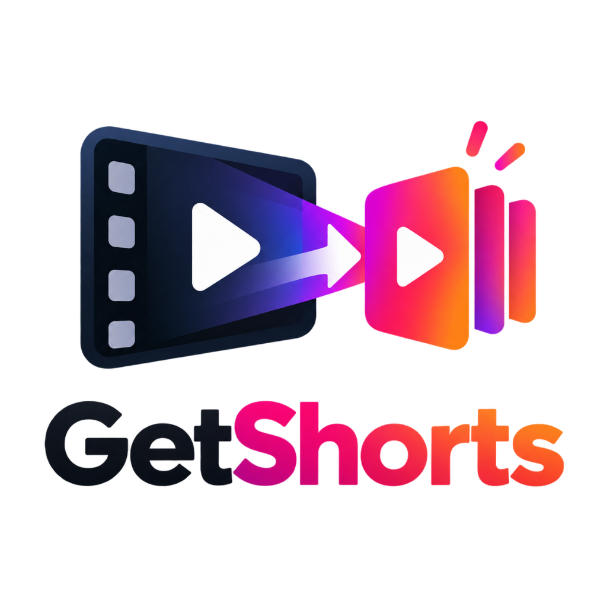
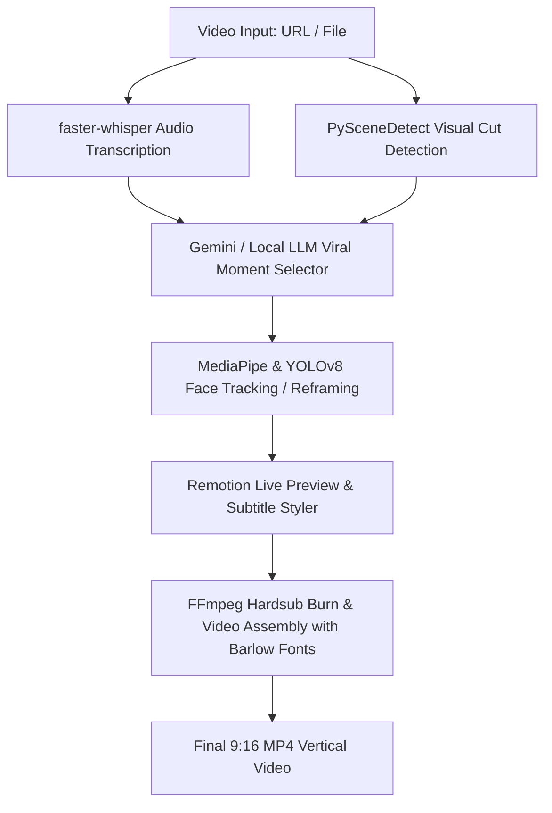

# 🎬 GetShorts

<p align="center">
  
</p>

<p align="center">
  <strong>Next-Gen Open-Source AI Video Platform & Short-Form Content Generator</strong>
</p>

<p align="center">
  <a href="https://opensource.org/licenses/MIT"></a>
  <a href="https://www.python.org/"></a>
  <a href="https://react.dev/"></a>
  <a href="https://fastapi.tiangolo.com/"></a>
  <a href="https://www.remotion.dev/"></a>
  <a href="https://ffmpeg.org/"></a>
  <a href="https://github.com/zeishansheikh/GetShorts/stargazers"></a>
</p>

---

## 🌟 Overview

**GetShorts** is a self-hostable, open-source AI video platform that turns long-form content (podcasts, tutorials, interviews, streams, YouTube videos) into viral-ready **9:16 vertical shorts** for **TikTok**, **Instagram Reels**, and **YouTube Shorts**.

Everything runs directly on your machine with **zero watermarks, zero subscription fees, and complete data privacy**.

---

## ⚡ Key Features

### 1. ✂️ Smart AI Video Clipping & Reframing
- **AI Viral Moment Detection**: Analyzes transcripts and scene boundaries using Google Gemini or local LLMs (Ollama / vLLM / LM Studio) to identify high-engagement 15–60s segments.
- **Intelligent 9:16 Reframing**:
  - **TRACK Mode**: Keeps the active speaker perfectly centered using MediaPipe face detection with a YOLOv8 fallback and tripod stabilization.
  - **SPLIT Mode**: Vertically stacks two speakers instead of shrinking wide camera angles.
  - **GENERAL Mode**: Blurs background borders for wide cinematic and group shots.
  - **SCREENCAST Mode**: Positions presenters cleanly over screencasts and presentations.

### 2. 💬 Modern Subtitles with Barlow Typography
- **Word-Level Subtitle Sync**: Powered by `faster-whisper` for timestamp precision.
- **Premium Barlow Font Suite**: Subtitles default to clean, modern **`Barlow-ExtraLight`** typography for professional readability.
- **Dynamic Animation Styles**: Karaoke active word highlights, bouncy pop animations, outlines, drop shadows, and pill backgrounds.
- **Live Remotion Previews**: In-browser preview rendered through Remotion before burning with FFmpeg.

### 3. 🤖 AI Shorts (UGC Video Creator)
- Generate product marketing videos and UGC-style shorts from simple prompts or website URLs.
- AI-written viral scripts (Hook → Problem → Solution → Call to Action).
- Photorealistic AI actors with lip-sync and custom ElevenLabs voiceovers.
- Dynamic b-roll footage generation with Ken Burns pan & zoom motion.

### 4. 🚀 YouTube Studio Toolkit
- **Viral Title Generator**: Suggests 10 high-CTR video title options with conversational refinement.
- **Description & Chapters**: Automatically produces descriptions with chapter timestamps.
- **Thumbnail Creator**: AI thumbnail generator with customized face overlays and graphics.

### 5. 📲 One-Click Social Publishing
- Direct scheduling and auto-posting to **TikTok**, **Instagram**, and **YouTube Shorts** via Upload-Post integration.

---

## 🛠️ Architecture & Tech Stack



- **Backend**: Python 3.11, FastAPI, Uvicorn, FFmpeg, faster-whisper, PySceneDetect, MediaPipe, Ultralytics YOLOv8
- **Frontend**: React 18, Vite, Remotion Player, TailwindCSS / CSS, Lucide icons
- **AI Models**: Google Gemini 2.5 / 3.x Flash, ElevenLabs TTS, Flux / Fal.ai, faster-whisper (large-v3 / medium)

---

## 🚀 Getting Started

### Prerequisites
- **Python 3.11+**
- **Node.js 18+** & **pnpm**
- **FFmpeg** installed on your system

### 1. Clone the Repository
```bash
git clone https://github.com/zeishansheikh/GetShorts.git
cd GetShorts
```

### 2. Backend Setup
```bash
# Create virtual environment
python3 -m venv .venv
source .venv/bin/activate

# Install dependencies
pip install -r requirements.txt

# Start FastAPI backend
uvicorn app:app --host 0.0.0.0 --port 8000
```

### 3. Frontend Setup
In a new terminal window:
```bash
cd dashboard

# Install frontend dependencies
pnpm install

# Start Vite dev server
pnpm run dev
```

Open **`http://localhost:5173`** in your browser to access the GetShorts dashboard!

---

## 🐳 Docker Deployment

To launch GetShorts with a single command via Docker Compose:

```bash
docker compose up --build
```
Access the application at `http://localhost:5175`.

---

## 🔑 Environment Variables

Create a `.env` file in the project root:

```env
# AI Moment Detection & Analysis (Free tier available)
GEMINI_API_KEY=your_gemini_api_key

# (Optional) Run fully local LLM for moment detection
# LLM_BASE_URL=http://localhost:11434/v1
# LLM_MODEL=llama3.2

# (Optional) Voiceover & Dubbing
ELEVENLABS_API_KEY=your_elevenlabs_key

# (Optional) Direct Social Media Publishing
UPLOAD_POST_API_KEY=your_upload_post_key
```

---

## 🔤 Custom Fonts & Subtitle Styling

GetShorts comes pre-packaged with the complete **Barlow Font Family**:
- Fonts are located in `fonts/` for FFmpeg `libass` rendering.
- Web font assets are served from `dashboard/public/fonts/` for real-time Remotion previewing.
- The default subtitle style uses **`Barlow-ExtraLight`** with high-contrast outlines for a sleek, contemporary social-media aesthetic.

---

## 🤝 Contributing

Contributions, bug reports, and feature requests are welcome!
1. Fork the Project
2. Create your Feature Branch (`git checkout -b feature/AmazingFeature`)
3. Commit your Changes (`git commit -m 'feat: add some amazing feature'`)
4. Push to the Branch (`git push origin feature/AmazingFeature`)
5. Open a Pull Request

---

## 📄 License

Distributed under the **MIT License**. Created & maintained by [Zeishan Sheikh](https://github.com/zeishansheikh).
